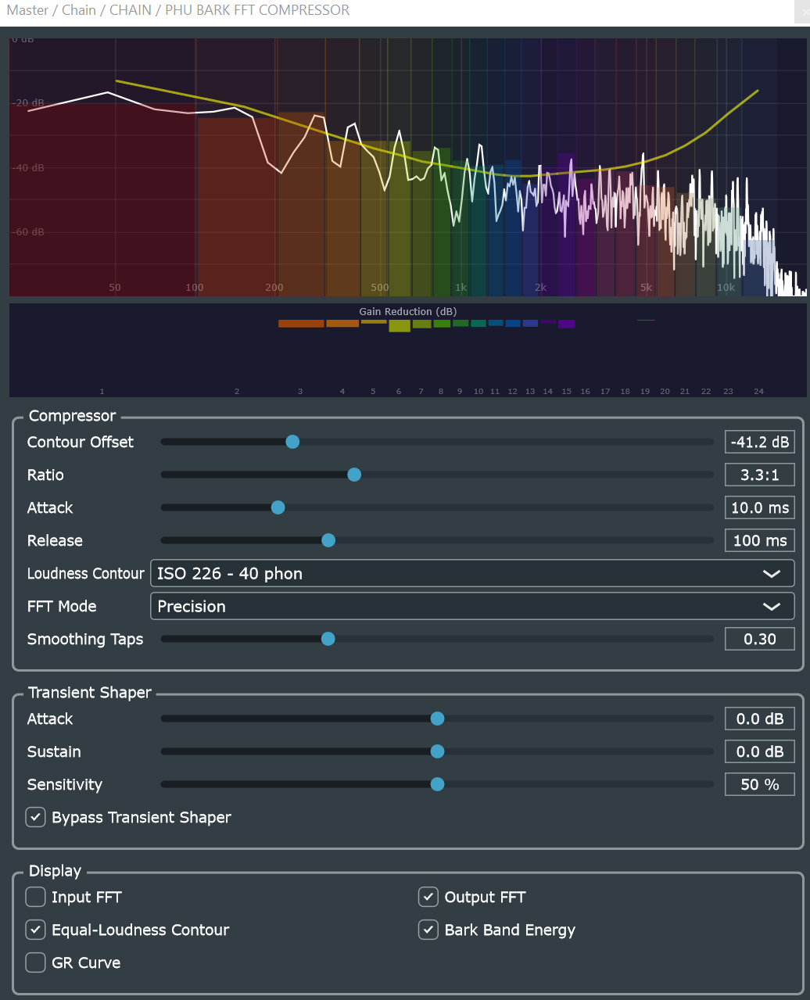

# PHU Bark FFT Compressor

[](https://github.com/huberp/phu-bark-fft-compressor/actions/workflows/build.yml)
[](https://github.com/huberp/phu-bark-fft-compressor/actions/workflows/release.yml)
[](LICENSE)
[](#building)
[](#building)
[](https://juce.com)
[](https://ko-fi.com/phuplugins)

A VST3 spectral compressor that operates independently on each of the 24 psychoacoustic Bark bands. Compression thresholds follow a selectable ISO 226 equal-loudness contour, so gain reduction tracks how the human ear actually perceives loudness rather than raw amplitude.



---

## Contents

- [Highlights](#highlights)
- [User Guide](#user-guide)
- [Building](#building)
- [Architecture](#architecture)
- [License](#license)

---

## Highlights

🎛️ **Bark-band spectral compression** — the audio spectrum is divided into 24 perceptual Bark bands (matching the human auditory system's critical bands). Each band is compressed independently, so a loud kick drum cannot push down the detail in a vocal or hi-hat.

📐 **Equal-loudness contour threshold shaping** — the compression threshold follows an ISO 226 equal-loudness contour (20, 40, 60, or 80 phon) or a flat curve. The contour is shifted up or down by the **Contour Offset** parameter, giving a single musically meaningful control over how aggressively each frequency region is compressed relative to how the ear hears it.

⚡ **Two FFT modes** — *Precision* mode uses a larger FFT window (2048 / 4096 samples) for fine frequency resolution; *Transient* mode uses a smaller window (1024 / 2048 samples) for tighter time-domain response. Both modes use 50% overlap-add with a periodic Hann window for transparent reconstruction.

🔎 **Integrated transient shaper** — a dual-envelope follower stage downstream of the compressor provides independent boost or cut of attack transients and sustained body (±24 dB each), with an adjustable detection sensitivity. The shaper can be bypassed independently.

📊 **Live spectral display** — the spectrum view overlays the input and/or output FFT curve against colour-coded Bark band regions and the selected equal-loudness contour. A gain reduction bar below the spectrum shows per-band compression activity in real time using the same per-band colour coding.

---

## User Guide

### Installation

1. Download the latest release from [Releases](https://github.com/huberp/phu-bark-fft-compressor/releases)
2. Copy the `.vst3` bundle to your DAW's VST3 folder:
   - Windows: `C:\Program Files\Common Files\VST3\`
   - Linux: `~/.vst3/` or `/usr/lib/vst3/`
3. Rescan plugins in your DAW
4. Load **PHU BARK FFT COMPRESSOR** on any track

**Windows:** Requires the [Microsoft Visual C++ 2015–2022 Redistributable (x64)](https://aka.ms/vs/17/release/vc_redist.x64.exe). Already present if Visual Studio 2019 or 2022 is installed.  
**Linux:** No external dependencies — the binary is self-contained.

### Controls

**Compressor group**

| Parameter | Range | Description |
|---|---|---|
| Contour Offset | −60 … +20 dB | Shifts the entire equal-loudness contour up or down. Lower values increase gain reduction across the board; higher values make the compressor more selective. |
| Ratio | 1:1 … 20:1 | Per-band compression ratio applied when a band's energy exceeds its threshold. |
| Attack | 0.1 … 500 ms | Time for gain reduction to engage after a band crosses threshold. |
| Release | 1 … 2000 ms | Time for gain reduction to recover after a band falls below threshold. |
| Loudness Contour | ISO 226 20/40/60/80 phon, Flat | Selects which equal-loudness curve shapes the per-band threshold. Lower-phon curves compress high and low frequencies more aggressively (matching the ear's reduced sensitivity at those frequencies). |
| FFT Mode | Precision / Transient | Precision: larger FFT for better frequency resolution. Transient: smaller FFT for faster time response. |
| Smoothing Taps | 0 … 1 | IIR smoothing applied to per-band gain reduction updates, trading temporal response for stability. |

**Transient Shaper group**

| Parameter | Range | Description |
|---|---|---|
| Attack | −24 … +24 dB | Gain applied to detected attack transients (fast envelope > slow envelope by the detection ratio). |
| Sustain | −24 … +24 dB | Gain applied to non-transient (sustained) portions of the signal. |
| Sensitivity | 0 … 100 % | Controls how strongly the fast envelope must exceed the slow envelope to be classified as a transient. High sensitivity triggers on subtle peaks; low sensitivity only catches strong hits. |
| Bypass Transient Shaper | checkbox | Disables the transient shaper stage entirely with zero CPU overhead. |

**Display group**

| Toggle | Effect |
|---|---|
| Input FFT | Shows the pre-compression spectrum as a white curve. |
| Output FFT | Shows the post-compression spectrum. |
| Equal-Loudness Contour | Overlays the active ISO 226 contour (yellow). |
| Bark Band Energy | Draws coloured bar regions showing per-band compressor energy. |
| GR Curve | Overlays the current gain reduction envelope across frequency. |

---

## Building

### Prerequisites

| Tool | Minimum version |
|---|---|
| CMake | 3.15 |
| C++ compiler | C++17 — MSVC 2022, GCC 11, or Clang 14 |
| JUCE | 8.0.12 (included as git submodule) |
| Intel MKL | oneAPI 2021.1+ (optional) for FFT acceleration |

**Intel MKL (optional):** If Intel MKL is installed and the `MKLROOT` environment variable is set, the build will automatically use MKL's optimised FFT implementation instead of JUCE's fallback. This can significantly improve FFT performance. To disable MKL support, pass `-DUSE_INTEL_MKL=OFF` to CMake.

### Clone

```bash
git clone https://github.com/huberp/phu-bark-fft-compressor.git
cd phu-bark-fft-compressor
git submodule update --init --recursive
```

### Windows

```powershell
# Find the CMake executable (it may not be on PATH in all environments)
.\scripts\find-cmake.ps1

cmake --preset vs2026-x64
cmake --build --preset release
```

**With Intel MKL:** Set the `MKLROOT` environment variable before running CMake:
```powershell
# For 64-bit MKL (most common):
$env:MKLROOT = "C:\Program Files\Intel\oneAPI\mkl\latest"
# For 32-bit MKL on 64-bit Windows:
# $env:MKLROOT = "C:\Program Files (x86)\Intel\oneAPI\mkl\latest"
cmake --preset vs2026-x64
cmake --build --preset release
```

Output: `build/vs2026-x64/src/phu-bark-fft-compressor_artefacts/Release/VST3/`

### Linux

```bash
sudo bash scripts/install-linux-deps.sh
cmake --preset linux-release
cmake --build --preset linux-build
```

**With Intel MKL:** Set the `MKLROOT` environment variable before running CMake:
```bash
export MKLROOT=/opt/intel/oneapi/mkl/latest
cmake --preset linux-release
cmake --build --preset linux-build
```

If the build times out: `cmake --build --preset linux-build -j2`

Output: `build/linux-release/src/phu-bark-fft-compressor_artefacts/VST3/`

---

## Architecture

### Core Components

| Component | Location | Responsibility |
|---|---|---|
| `BarkFFTCompressor` | `lib/audio/BarkFFTCompressor.h` | Header-only FFT-based spectral compressor. 2048/4096-point (Precision) or 1024/2048-point (Transient) FFT with 50% overlap-add Hann window. Maps FFT bins to 24 Bark bands, computes per-band energy, applies threshold/ratio/attack/release gain reduction relative to the selected ISO 226 contour. |
| `TransientShaper` | `lib/audio/TransientShaper.h` | Header-only dual-envelope-follower transient processor. Fast (~2 ms) and slow (~50 ms) envelope followers classify each sample as attack or sustain, applying independent dB gains to each. |
| `AudioSampleFifo` | `lib/audio/AudioSampleFifo.h` | Lock-free single-producer / single-consumer FIFO for transferring audio samples from the audio thread to the UI thread. Used to feed both input and output spectra to the display. |
| `FFTProcessor` | `lib/audio/FFTProcessor.h` | UI-thread FFT processor. Accumulates samples from an `AudioSampleFifo`, applies a Hann window, and runs a forward FFT to produce the magnitude spectrum drawn by `SpectrumDisplay`. |
| `SpectrumDisplay` | `src/SpectrumDisplay.h/cpp` | JUCE `Component` rendered at 60 Hz. Draws the log-frequency / dB spectrum, Bark-band colour regions, equal-loudness contour overlay, and per-band gain reduction bar. |
| `PluginProcessor` | `src/PluginProcessor.h/cpp` | `AudioProcessor` + APVTS. Owns `BarkFFTCompressor`, `TransientShaper`, and the two `AudioSampleFifo`s (input + output). APVTS atomic parameter pointers are read on the audio thread without locking. |
| `PluginEditor` | `src/PluginEditor.h/cpp` | UI layout and 60 Hz refresh timer. Drains both FIFOs, triggers `FFTProcessor` updates, and repaints `SpectrumDisplay`. |

### DSP Signal Path

```
processBlock (audio thread)
  ├─ Push L+R samples → InputFifo  (for UI input spectrum)
  │
  ├─ For each sample:
  │    ├─ BarkFFTCompressor::processSample()
  │    │    ├─ Ring-buffer accumulation
  │    │    ├─ Every hopSize samples:
  │    │    │    ├─ Hann-window + forward FFT
  │    │    │    ├─ Compute power per Bark band (→ dBFS via kFFTNormDb)
  │    │    │    ├─ Compare to ISO 226 contour + Contour Offset threshold
  │    │    │    ├─ Per-band attack/release gain smoothing
  │    │    │    ├─ Multiply FFT bins by band gains
  │    │    │    └─ Inverse FFT + overlap-add → output sample
  │    └─ TransientShaper::processSample()
  │         ├─ Fast envelope vs. slow envelope ratio
  │         └─ Apply attackGain or sustainGain
  │
  └─ Push L+R samples → OutputFifo  (for UI output spectrum)

UI Timer (60 Hz)
  ├─ Drain InputFifo  → FFTProcessor (input)  → SpectrumDisplay
  ├─ Drain OutputFifo → FFTProcessor (output) → SpectrumDisplay
  ├─ Read per-band gain reduction from BarkFFTCompressor
  └─ repaint SpectrumDisplay
```

### Bark Band Mapping

The 24 Bark bands follow the standard critical-band scale defined by Zwicker (1961). FFT bins are mapped to bands at `prepare()` time using the formula:

$$\text{Bark}(f) = 13 \cdot \arctan\!\left(\frac{0.76\,f}{1000}\right) + 3.5 \cdot \arctan\!\left(\left(\frac{f}{7500}\right)^2\right)$$

Each band's threshold is the value of the selected ISO 226 contour at the band's centre frequency, offset by the **Contour Offset** parameter.

### FFT Mode & Latency

| Mode | FFT size (≤48 kHz) | FFT size (>48 kHz) | Latency |
|---|---|---|---|
| Precision | 2048 | 4096 | 1024 / 2048 samples (50% hop) |
| Transient | 1024 | 2048 | 512 / 1024 samples (50% hop) |

Reported latency (`getTailLengthSeconds`) is half the FFT size — the overlap-add hop.

---

## License

[MIT](LICENSE)
